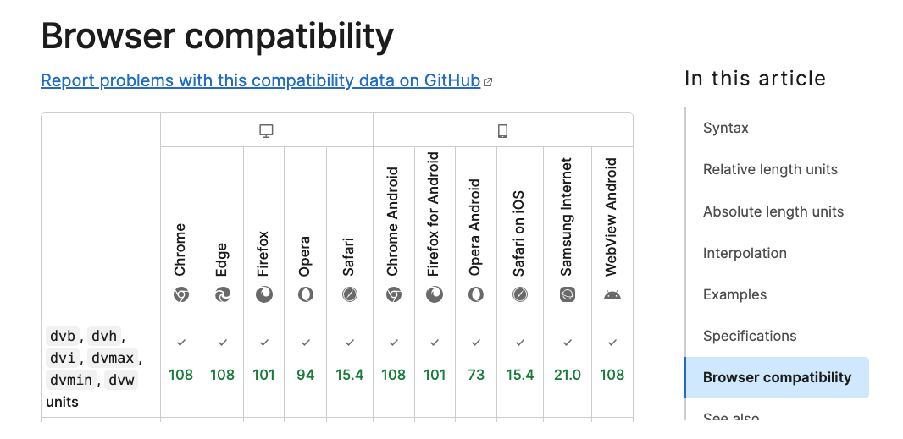

In today's mobile-first era, ensuring your website looks great on all screen sizes is crucial. 

On mobile devices, viewport sizes fluctuate due to [dynamic toolbars](https://web.dev/blog/viewport-units#the-need-for-new-viewport-units) like address bars and tab bars, causing elements to potentially overflow beyond the viewport.

To address this issue, the CSS Working Group introduced [dynamic viewport units](https://developer.mozilla.org/en-US/docs/Web/CSS/length#dynamic) (like dvw, dvh, dvi, dvb, dvmin, dvmax).

Implementing these units into your website allows it to be responsive across desktop and mobile platforms.

<!--endintro-->

Dynamic viewport units are [compatible with every browser](https://developer.mozilla.org/en-US/docs/Web/CSS/length#browser_compatibility) and is even supported in popular CSS frameworks like [Tailwind CSS (as of v3.4)](https://tailwindcss.com/blog/tailwindcss-v3-4#dynamic-viewport-units)

::: img-medium

:::
